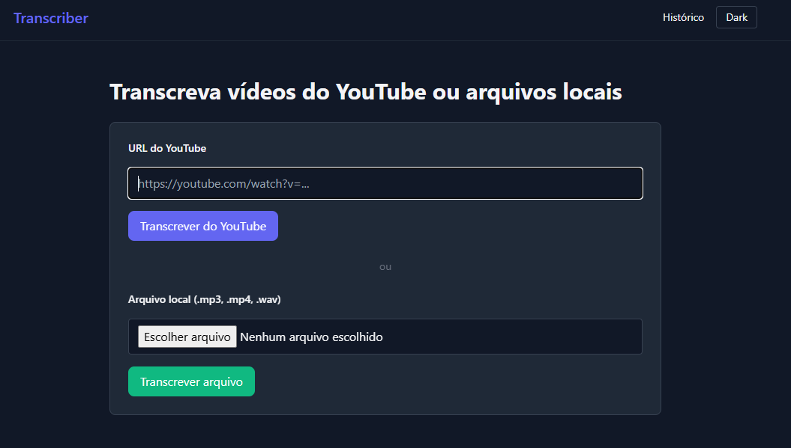

[](https://www.python.org/)
[](https://fastapi.tiangolo.com/)
[](https://www.docker.com/)
[](./LICENSE)
[](https://github.com/Br3n0k/transcriber/pulls)
---

# Transcriber

A fast, friendly, and open-source web app for transcribing audio and video with Whisper.
Developed by [Brendown Ferreira](https://github.com/Br3n0k).

Easily upload local files or paste a YouTube URL, watch a sleek progress overlay, and download your transcript as `.txt`.
Built with **FastAPI, Jinja2, Tailwind, and Alpine.js** — lightweight, modern, and easy to hack on.



---

## ✨ Features

* 🎥 Transcribe from YouTube URLs or local audio/video files
* ⚡ Two Whisper backends with automatic fallback:

  * **openai-whisper** (preferred when FFmpeg is available)
  * **faster-whisper** (fallback, works even without FFmpeg)
* 🚀 GPU acceleration (CUDA) when available, seamless CPU fallback otherwise
* 🔎 Robust FFmpeg detection (`PATH` and `imageio-ffmpeg`)
* 🌓 Clean UI with dark/light mode, progress bar, and smooth overlay
* 📜 Transcript history with one-click download
* 🧹 Temporary media cleanup after transcription
* ✅ Health check endpoint for quick status

---

## 🛠 Tech Stack

* **Backend:** FastAPI, Uvicorn
* **Frontend:** Jinja2 templates, Tailwind (CDN), Alpine.js
* **Media & ML:** yt-dlp, Whisper (openai-whisper + faster-whisper), PyTorch
* **Utilities:** python-dotenv, pydantic

---

## 📂 Project Structure

```txt
app/
 ├─ main.py                # FastAPI app + router registration
 ├─ core/
 │   ├─ config.py          # Environment + directories
 │   └─ theme.py           # Default theme + template globals
 ├─ routers/
 │   ├─ home.py            # GET /
 │   ├─ upload.py          # POST /transcribe/*
 │   └─ history.py         # GET /history
 ├─ services/
 │   ├─ youtube.py         # YouTube download logic
 │   ├─ transcriber.py     # FFmpeg detection + Whisper backends
 │   └─ file_manager.py    # File save/load/transcript listing
 ├─ templates/             # Jinja2 templates (UI)
 └─ static/                # CSS, JS, etc.
storage/
 ├─ uploads/
 └─ transcriptions/
tests/                     # End-to-end validation scripts
```

---

## ⚙️ Requirements

* Python **3.10+**
* **FFmpeg** (optional but recommended)
* NVIDIA GPU + CUDA (optional, for acceleration)

> On Windows, requirements.txt pins the CUDA 12.4 wheel index for PyTorch.
> CPU-only mode works out of the box.

---

## 🚀 Quickstart

**Windows (PowerShell):**

```powershell
python -m venv .venv
.\.venv\Scripts\Activate.ps1
pip install -r requirements.txt --upgrade --no-cache-dir
python -m uvicorn app.main:app --reload --host 0.0.0.0 --port 8000
```

**macOS/Linux:**

```bash
python -m venv .venv
source .venv/bin/activate
pip install -r requirements.txt --upgrade --no-cache-dir
uvicorn app.main:app --reload --host 0.0.0.0 --port 8000
```

Then open: [http://localhost:8000](http://localhost:8000)

---

## 🐳 Run with Docker

```bash
docker build -t transcribe-hub .
docker run --rm -p 8000:8000 transcribe-hub
```

For GPU support, enable [NVIDIA Container Toolkit](https://docs.nvidia.com/datacenter/cloud-native/container-toolkit/overview.html).

---

## 📖 Usage

* Go to `/` → paste a YouTube URL or upload a file
* Watch the progress overlay
* View transcript + download as `.txt`
* Visit `/history` to browse past transcripts

**Endpoints:**

* `GET /` → UI
* `POST /transcribe/youtube` → YouTube → transcript
* `POST /transcribe/upload` → Local file → transcript
* `GET /history` → List transcripts
* `GET /download/{filename}` → Download transcript
* `GET /health` → Health check

---

## 🧪 Testing

Run all tests with:

```bash
pytest -q
```

Key tests include:

* `test_imports.py` → ML/media library checks
* `test_download.py` → yt-dlp validation
* `test_transcribe_direct.py` → Direct transcription flow
* `test_call_api.py` → API endpoint validation

---

## 🤝 Contributing

Contributions are welcome! 🎉
Whether it’s bug fixes, features, or docs:

1. Fork the repo
2. Create a branch (`feature/my-idea`)
3. Commit & push
4. Open a Pull Request

---

## 🧩 Troubleshooting

* **FFmpeg not found:** install FFmpeg or rely on `imageio-ffmpeg` fallback
* **GPU not used:** check CUDA drivers and run `torch.cuda.is_available()`
* **Large files slow:** progress bar is an estimate; consider SSE/WebSockets for real-time updates

---

## 📜 License

Open Source — see [LICENSE](./LICENSE).

---